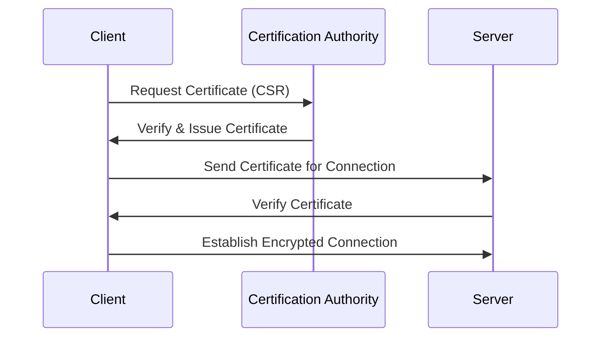

## Digitales Zertifikat

Ein digitales Zertifikat ist ein elektronisches Dokument, das die Identität einer Person, Organisation oder eines Geräts bestätigt und digitale Kommunikation sichert.

### Funktionsweise

Ein digitales Zertifikat funktioniert technisch auf der Grundlage der Public-Key-Infrastruktur (PKI), die asymmetrische Kryptografie verwendet. Hier ist, wie es funktioniert:

**Schlüsselerzeugung**

- Zuerst erzeugt der Zertifikatsantragsteller ein Schlüsselpaar bestehend aus einem öffentlichen und einem privaten Schlüssel. Der private Schlüssel bleibt geheim und sicher beim Antragsteller, während der öffentliche Schlüssel öffentlich geteilt werden kann.

**Zertifikatsantrag**

- Der Antragsteller sendet einen Zertifikatsignierantrag (Certificate Signing Request, CSR) an eine Zertifizierungsstelle (Certification Authority, CA). Der CSR enthält den öffentlichen Schlüssel, Identitätsinformationen des Antragstellers und wird mit dem privaten Schlüssel signiert.

**Überprüfung und Ausstellung**

- Die CA überprüft die Identität des Antragstellers und die Echtheit des Antrags. Wenn alles korrekt ist, erstellt die CA ein digitales Zertifikat, das den öffentlichen Schlüssel des Antragstellers, Identitätsinformationen und andere relevante Daten enthält. Die CA signiert das Zertifikat mit ihrem eigenen privaten Schlüssel, um dessen Gültigkeit zu bestätigen.

**Nutzung des Zertifikats**

- Der Zertifikatsinhaber kann nun das digitale Zertifikat verwenden, um seine Identität zu beweisen und sicher mit anderen zu kommunizieren. Zum Beispiel in einer SSL/TLS-Verbindung sendet der Server sein Zertifikat an den Client, der den öffentlichen Schlüssel des Servers verwendet, um die Kommunikation zu verschlüsseln.

**Verifizierung**

- Die Empfängerseite (z.B. ein Webbrowser) überprüft das Zertifikat anhand der Signatur der CA. Der Browser hat eine Liste vertrauenswürdiger CA-Zertifikate gespeichert und nutzt diese, um zu überprüfen, ob das empfangene Zertifikat gültig ist.

**Verschlüsselte Kommunikation**

- Nach erfolgreicher Verifizierung des Zertifikats kann eine sichere, verschlüsselte Kommunikation zwischen den Parteien stattfinden. Der öffentliche Schlüssel wird verwendet, um Daten zu verschlüsseln, die nur mit dem privaten Schlüssel des Empfängers entschlüsselt werden können.

Durch diesen Prozess ermöglichen digitale Zertifikate die Authentifizierung der Identität von Personen oder Geräten und die sichere Übertragung von Informationen im Internet.

### Zertifikatsantragsteller (Subject)

Der Zertifikatsantragsteller ist die Person oder Organisation, die ein digitales Zertifikat anfordert. Dieser Antragsteller, oft als „Subject“ oder „End Entity“ bezeichnet, generiert ein Schlüsselpaar, das aus einem öffentlichen und einem privaten Schlüssel besteht. Der öffentliche Schlüssel wird dann zusammen mit Identitätsinformationen, wie dem Namen der Organisation, der E-Mail-Adresse oder der Domain, an eine Zertifizierungsstelle (Certification Authority, CA) gesendet, in Form eines Zertifikatsignierantrags (Certificate Signing Request, CSR).

Die Rolle des Zertifikatsantragstellers umfasst typischerweise:

Ein Individuum, eine Organisation oder ein Gerät, das seine Identität gegenüber anderen über das Internet sicher nachweisen möchte.
Unternehmen oder Webseitenbetreiber, die sichere HTTPS-Verbindungen für ihre Webseiten anbieten wollen.
Entwickler oder Softwarefirmen, die ihre Anwendungen mittels Code-Signierungszertifikaten authentifizieren möchten.
Der Prozess beginnt damit, dass der Antragsteller seine Identitätsinformationen und den öffentlichen Schlüssel an die CA zur Überprüfung und Zertifikatsausstellung sendet.

